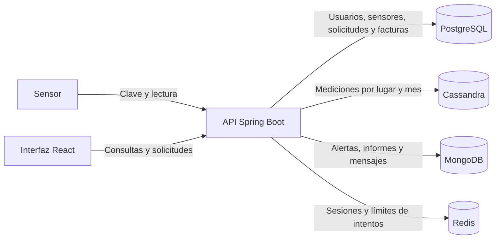

# AtlasClima: presentación del proyecto

AtlasClima es un observatorio climático desarrollado como aplicación web. Permite registrar sensores, recibir lecturas de temperatura y humedad, consultar su evolución por ubicación, detectar situaciones que requieren atención y generar informes. También incluye usuarios con distintos permisos, mensajería y una facturación asociada a los informes.

El proyecto sirve para practicar el uso de diferentes bases de datos, tanto SQL como NoSQL y utilizarlas según lo que son mejor cada una. También sirve de repaso para el desarrollo completo de una aplicación: una interfaz que consume una API, reglas de negocio en el backend y frontend. Para instalarlo y ejecutarlo, consultá el [README](../README.md).

## Qué hace la aplicación

- **Sensores y mediciones:** el personal registra sensores y controla su estado. Cada sensor tiene una clave para enviar lecturas; también existe una carga manual para técnicos y administradores. Las mediciones se consultan por ciudad, zona o país y por período.
- **Alertas:** una lectura fuera de los umbrales configurados genera una alerta climática. También se detectan sensores que llevan más de una hora sin reportar. El personal puede revisar y resolver alertas.
- **Informes:** un administrador define los procesos disponibles, su precio y los roles que pueden solicitarlos. Un usuario o técnico autorizado envía una solicitud; un técnico o administrador la ejecuta. Hay informes de valores mínimos y máximos, promedios, lecturas sin agrupar y valores fuera de un umbral. Los promedios periódicos pueden volver a ejecutarse automáticamente.
- **Facturación:** al completar un informe se crea una factura. La aplicación muestra facturas, pagos y movimientos de cuenta. Un administrador puede registrar un pago que ya verificó fuera del sistema; no hay una pasarela de cobro integrada.
- **Comunicación:** los usuarios pueden enviarse mensajes privados y participar en grupos. Los administradores crean grupos y agregan integrantes.

Cada cuenta tiene **un solo rol**: Usuario, Técnico o Administrador. El registro público asigna Usuario. Un administrador puede cambiar el rol de otra cuenta; al hacerlo, se cierran sus sesiones activas. Los administradores gestionan procesos y pueden ejecutar solicitudes, pero no pueden pedir informes para sí mismos. Una solicitud empieza como `PENDING`: hoy la acción del personal es **Ejecutar** o, si falla, **Reintentar**; no hay una aprobación o rechazo por separado.

## Recorrido de una medición

1. Un sensor envía temperatura o humedad junto con su clave. La API comprueba la clave y que el sensor esté activo.
2. La lectura se guarda en Cassandra para tres ámbitos de consulta: ciudad, zona y país. Si excede un umbral, se crea una alerta en MongoDB.
3. Una persona consulta las mediciones desde la interfaz o solicita un informe para una ubicación y un período.
4. Al ejecutar la solicitud, la API lee Cassandra, calcula el resultado, guarda el informe en MongoDB y registra la ejecución y la factura en PostgreSQL.

## Tecnologías elegidas y motivo

| Tecnología | Uso en AtlasClima | Motivo de la elección |
|---|---|---|
| **React y TypeScript** | Páginas, formularios, navegación y consumo de la API. | Construir componentes reutilizables y comprobar los tipos de datos durante el desarrollo. |
| **Vite** | Servidor de desarrollo y compilación del frontend. | Simplificar la puesta en marcha local y generar los archivos estáticos de la interfaz. |
| **Recharts y Lucide React** | Gráficas de mediciones e iconos. | Comunicar tendencias y estados de forma visual. |
| **Java 21 y Spring Boot** | API HTTP, servicios, validación, tareas programadas y coordinación de los almacenes. | Separar las reglas de negocio de la interfaz y disponer de herramientas para seguridad, acceso a datos y pruebas. |
| **Spring Security** | Autenticación con token y autorización por rol. | Comprobar los permisos en la API, donde se protegen los datos y las operaciones. |
| **PostgreSQL, JDBC y Flyway** | Usuarios, roles, sensores, solicitudes, ejecuciones y facturación. | Usar relaciones, restricciones y transacciones para datos que requieren consistencia; Flyway versiona el esquema. |
| **Cassandra** | Lecturas de temperatura y humedad organizadas por lugar y mes. | Practicar un modelo de series temporales diseñado alrededor de las consultas y de escrituras frecuentes. |
| **MongoDB** | Informes, alertas y mensajes. | Guardar documentos cuyo contenido puede variar, como los resultados de distintos procesos. |
| **Redis** | Sesiones activas y límites de solicitudes. | Utilizar claves con vencimiento y contadores rápidos; PostgreSQL conserva el historial de sesiones. |
| **Docker Compose** | PostgreSQL, Cassandra, MongoDB y Redis en el entorno local. | Reproducir las dependencias del proyecto sin instalarlas una por una en el equipo. |
| **Maven, npm y pruebas** | Dependencias, compilación y verificaciones del backend y la interfaz. | Hacer repetible el trabajo y detectar regresiones. |

La elección de cuatro almacenes permite comparar modelos de datos, pero también agrega complejidad. Por ejemplo, Cassandra repite una lectura en tres ámbitos para facilitar las consultas; MongoDB no ofrece claves foráneas hacia PostgreSQL; y una ejecución que cruza varias bases no puede cerrarse con una sola transacción. La aplicación intenta compensar un fallo al generar un informe, aunque una instalación de producción necesitaría reconciliación y seguimiento adicionales.

## Temas que se practican

1. **Diseño de una API REST:** rutas HTTP, códigos de respuesta, validación de entradas, separación entre controladores y servicios, y manejo de errores.
2. **Autenticación y permisos:** registro, inicio y cierre de sesión, tokens, roles, acceso a recursos propios y protección de operaciones administrativas.
3. **Modelado relacional:** claves primarias y foráneas, restricciones, índices, consultas parametrizadas, migraciones y transacciones para facturas y pagos.
4. **Modelado NoSQL:** particiones y desnormalización en Cassandra, documentos e índices en MongoDB, y claves con expiración en Redis.
5. **Series temporales y análisis:** consultas por lugar y período, agrupación por día, mes o año, promedios, extremos y umbrales.
6. **Procesos que continúan en el tiempo:** solicitudes con estados, reintentos, informes periódicos, detección programada de sensores sin señal y registro de fallas.
7. **Desarrollo de interfaces:** componentes React, estado, formularios, llamadas asíncronas, visualización de datos y presentación distinta según el rol.
8. **Integración y operación local:** configuración por entorno, contenedores, datos de demostración, pruebas automatizadas y revisión de dependencias.

## Dónde encontrar cada parte

| Parte | Archivos principales |
|---|---|
| Interfaz | [`frontend/src`](../frontend/src) y [`frontend/package.json`](../frontend/package.json) |
| API y reglas de negocio | [`src/main/java/com/poliglota/clima`](../src/main/java/com/poliglota/clima) |
| Esquema relacional | [Migraciones Flyway](../src/main/resources/db/migration) |
| Esquema de mediciones | [`db/cassandra.cql`](../db/cassandra.cql) |
| Servicios locales | [`compose.yaml`](../compose.yaml) |
| Pruebas y datos de ejemplo | [`src/test`](../src/test) y [`scripts`](../scripts) |

El [README](../README.md) contiene los comandos de instalación, los formatos de las solicitudes y las rutas de la API. La aplicación incluye una página **Acerca de** con una explicación visual de la arquitectura.
